# Harvard CS50x Track by Dat N. Le

> Harvard CS50x structured learning using P.A.C.E.R. loops, verified logs, and public outputs.

## Purpose

### **`CS50x's Learning = self-directed systems + protocol discipline + public artifacts`**

This is the my official CS50x's Track for constructing trackable learning systems from any course, project, or domain. Use this to:

- Structure your learning as **iteration cycles**, not passive consumption, verification (via P.A.C.E.R. protocol)
- Produce **trackable insights**, not fleeting thoughts, log-traceable progression
- Ship **public artifacts**, not private illusions
- Crystallize ⌬ **Mindstamps** — reusable thinking units, based on Second Mind OS OVL Protocol

> This repo to convert any study of CS50x into a systemized execution protocol.

## Track Summary

| Field           | Value                                                    |
| --------------- | -------------------------------------------------------- |
| Course          | [CS50x – Harvard University](https://cs50.harvard.edu/x) |
| Loops           | 11 completed (Week 00 → Week 10)                         |
| Logs            | 11 total trace entries                                   |
| Symbolic Claims | 27 `⌬` verified                                          |
| Timeframe       | Mar–June 2025                                            |
| Protocol        | Second Mind OS v1.1                                      |

## Insight Cover

> _Claim: “Pointer logic is memory geometry. Stack frames = layered cognition.” (Week 04)_

## 📃 Final Mini Paper

[**View Full Track Paper →**](./track-mini-paper.md)

> Full synthesis: system claims, insight loops, blockers, and execution scaffolds across 11 weeks.

## 📦 Final Project: MindVault

- **Repo:** [cs50x-final-mindvault](https://github.com/smind/cs50x-final-mindvault)
- **Demo:** 
- **Backlink:** [↩ Return to this Track](https://github.com/smind/track-cs50x)

> _Final Project product from CS50x track. Built with compile → run → validate protocol. Modular C backend with structured symbolic scaffolds._

---

## Folder Structure

| Folder                | Symbol | Role                                                  |
| --------------------- | ------ | ----------------------------------------------------- |
| `docs/`               | 📜     | Schemas, maps, notes, distilled knowledge             |
| `logs/`               | 📃     | Daily logs, blockers (`🚧`), insight pings            |
| `loop/`               | 🔁     | P.A.C.E.R. loops: Plan → Act → Check → Edit → Reflect |
| `outputs/`            | 📦     | Public-facing artifacts: blog, repo, showcase         |
| `track-mini-paper.md` |        | Artifact: track mini paper                            |
| `loop-card.png `      |        | Track quote                                           |
| `track.json`          |        | Track metadata for integration                        |
| `LICENSE`             |        | MIT License                                           |
| `README.md`           |        | This Document                                         |

> All symbols in this repo follow SMIND's [Naming Protocol Symbol](https://github.com/smindlab/smindlab/blob/1c5ba0bd92991554d946895a242d989ae0dc3877/meta/naming-protocol-symbol.md).

## Protocol Flow

```mermaid
graph TD
  A[CS50x's Content] --> B[Note Docs / Build Project / Problem]
  B --> C[P.A.C.E.R. Loop]
  C --> D[Write Logs + Loop Claim]
  D --> E[Claim ⌬ Symbol]
  E --> F[Public Output in outputs/]
  F --> G[Emit JSON to Personal Site]
```

> Note → Log → Loop → Output

### 🔁 P.A.C.E.R. Loop Protocol

Each learning unit runs through the **P.A.C.E.R. loop** — a minimal feedback protocol for deliberate skill formation:

| Stage     | Function                                |
| --------- | --------------------------------------- |
| `Plan`    | Define objective, scope, and constraint |
| `Act`     | Execute, build, engage with material    |
| `Check`   | Self-test, validate via examples/tests  |
| `Edit`    | Refactor, simplify, correct blindspots  |
| `Reflect` | Meta-log insights, blockers, claims     |

## Maintained by

**🧱 Second Mind OS Lab**
Protocol harmony, cognitive precision, outcome-driven learning.

⚓ Personal mastery is system-driven. Track everything. Reflect ruthlessly. Ship deliberately.

> _Powered by [**Second Mind OS Lab**](https://github.com/secondmindlab) — Protocol-first learning system for cognitive leverage._
