# Track Template Protocol by Second Mind OS (SMOS)

> Track your thinking. Loop your learning. Build public artifacts. Powered by SMOS.

**Canonical template** for learning tracks, project-based skill loops, and knowledge pipelines in the 🧱 Second Mind OS Lab.

## Purpose

### **`Learning = self-directed systems + protocol discipline + public artifacts`**

> Maximize your leverage. Build your cognitive stack. Ship high-signal work.

This is not a note-taking system.
This is not a journaling habit.
This is a **feedback loop protocol** — to think clearer, track deeper, and verify what you actually know.

This is the **official template** for constructing trackable learning systems from any course, project, or domain. Use this to:

- Structure your learning as **iteration cycles**, not passive consumption, verification (via P.A.C.E.R. protocol)
- Produce **trackable insights**, not fleeting thoughts, log-traceable progression
- Ship **public artifacts**, not private illusions
- Crystallize ⌬ **Mindstamps** — reusable thinking units, based on Second Mind OS OVL Protocol

> Fork this repo to convert any study path into a systemized execution protocol.

---

## Folder Structure

| Folder       | Emoji | Role                                                  |
| ------------ | ----- | ----------------------------------------------------- |
| `docs/`      | 🗂️    | Schemas, maps, notes, distilled knowledge             |
| `logs/`      | 📃    | Daily logs, blockers (`🚧`), insight pings            |
| `loop/`      | 🔁    | P.A.C.E.R. loops: Plan → Act → Check → Edit → Reflect |
| `outputs/`   | 🚀    | Public-facing artifacts: blog, repo, showcase         |
| `track.json` |       | (Optional) Track metadata for integration             |
| `LICENSE`    |       | MIT License                                           |
| `README.md`  |       | This Document                                         |

## Protocol Flow

```mermaid
graph TD
  A[Engage with Content] --> B[Note Docs / Build Project / Problem]
  B --> C[P.A.C.E.R. Loop]
  C --> D[Write Logs + Loop Claim]
  D --> E[Claim ⌬ Symbol]
  E --> F[Public Output in outputs/]
  F --> G[Emit JSON to Personal Site]
```



> Note → Log → Loop → Output

### 🔁 P.A.C.E.R. Loop Protocol

Each learning unit runs through the **P.A.C.E.R. loop** — a minimal feedback protocol for deliberate skill formation:

| Stage     | Function                                |
| --------- | --------------------------------------- |
| `Plan`    | Define objective, scope, and constraint |
| `Act`     | Execute, build, engage with material    |
| `Check`   | Self-test, validate via examples/tests  |
| `Edit`    | Refactor, simplify, correct blindspots  |
| `Reflect` | Meta-log insights, blockers, claims     |

Each folder in `loop/Week-X/` should contain a `pacer.yaml` or markdown journal documenting this cycle.

## Usage Instructions

1. **Fork this template** → rename to `USERNAME/[course|domain]` or `USERNAME/track-[course|domain]`
   e.g.: `track-cs50x`, `track-ml-zero`, `track-rust-os`

2. **Optional: Enable GitHub Pages**
   → Serve `outputs/` as public-facing artifacts

3. **Loop Structure**
   - New loop via CLI (Recommend) `python scripts/smos.py week-01 --topic="Memory & Pointers"`
   - Drop notes into `docs/`
   - Write blockers / insight logs in `logs/`
   - Launch a loop via `loop/week-01/pacer.yaml`, `loop/week-01/claim.md`, `loop/week-01/reflect.md`
   - Push deliverables to `outputs/`

#### Example:

```bash
track-cs50x/
├── docs/week-01.md                  # Schema of memory model
├── logs/YYYY-MM-DD-week-01.md       # Blocker resolution
├── loop/week-01/pacer.yaml          # P.A.C.E.R. config
├── loop/week-01/claim.md            # Distilled knowledge lock
├── loop/week-01/reflect.md          # Meta-log & feedback
├── outputs/week-01-output.md        # Artifact: reflection + code
```

#### Naming Convention (Optional):

Track repos should follow:

```
[course|domain|theme]
track-[course|domain|theme]
```

Examples:

- `cs50x`
- `openai-fine-tune`
- `track-ml-zero`
- `track-rust-os`
- `track-freecodecamp-js`

Use as **public fork base** for consistent naming across teams/orgs.

#### Recommended Add-ons

- [ ] GitHub Actions for JSON metadata export
- [ ] Auto-log CLI script (`log "note here"`)
- [ ] Auto-site render via `outputs/` → `gh-pages`

## License

MIT — use freely under your personal or team workflows.

> **Note**: All forks must include the following in `README.md`:  
> _Powered by [**Second Mind OS Lab**](https://github.com/secondmindlab) — Protocol-first learning system for cognitive leverage._

## Maintained by

**🧱 Second Mind OS Lab**
Protocol harmony, cognitive precision, outcome-driven learning.

⚓ Personal mastery is system-driven. Track everything. Reflect ruthlessly. Ship deliberately.

> _Powered by [**Second Mind OS Lab**](https://github.com/secondmindlab) — Protocol-first learning system for cognitive leverage._
