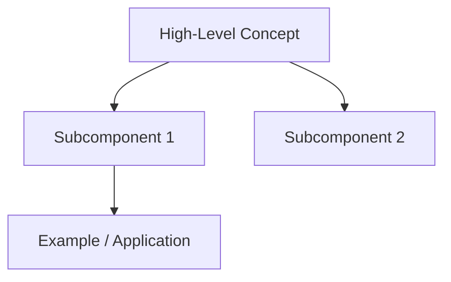

# Week 01 — [Topic]

> Track: [track-name]  
> Week: 01  
> Protocol: Second Mind OS  
> Format: Verified Thinking Notes + Schema-Driven Capture

## 1. Objective

- **Core Concept(s)**: What is being learned this week?
- **Outcome**: What am I expected to produce or understand?
- **Protocol Scope**: This note follows the PACER loop → it serves as a **Check + Reflect** anchor.

## 2. Concept Map & Schema

> Use this section to describe the concept using:

- Bullet schemas
- Diagrams (Mermaid or ASCII)
- Causal chains

## 3. Mental Models

| Concept         | Model / Metaphor                   | First-principle Breakdown         |
| --------------- | ---------------------------------- | --------------------------------- |
| \[e.g. Pointer] | "Memory arrow → points to a box"   | Address vs. value distinction     |
| \[e.g. Stack]   | Stack = vertical tray, LIFO system | Memory ordering via frame context |

## 4. 📣 ⌬ Insight Claims

List insights that are **non-obvious**, and **must be claimed explicitly**, not just mentioned.

| ⌬ ID | Claim Statement                              | Trigger Point | Verified In                    |
| ---- | -------------------------------------------- | ------------- | ------------------------------ |
| 001  | "A pointer holds an address, not the value"  | Lecture Q\&A  | `logs/YYYY-MM-DD-week-01-c.md` |
| 002  | "Refactoring reveals abstraction boundaries" | During pset   | `loop/week-01-c/pacer.yaml`    |

## 5. 🚧 Blockers & Ambiguities

> List anything unclear, buggy, unresolved. These can be escalated into logs.

- Why is stack memory auto-freed, but heap not?
- Pointer vs reference distinction in C vs Rust?

## 7. 🧪 Tests & Self-Checks

> Add one or more test questions to check understanding

1. Draw memory diagram of `int *p = &x;`, label addresses and values
2. When does segmentation fault occur when using pointers?

## 8. Trace Log & Learning Path

- [x] Watched Lecture 1
- [x] Read `Pointers in C` (CS50 Notes)
- [x] Completed `pset1-Mario`
- [ ] Created public output reflection
- [ ] Shared ⌬ card with claim `001`

## 9. 🔁 Linked Protocol Loops

| Loop Phase | Linked File                    |
| ---------- | ------------------------------ |
| Plan       | `loop/week-01-c/pacer.yaml`    |
| Reflect    | `logs/YYYY-MM-DD-week-01-c.md` |

---

> _Powered by [**Second Mind OS Lab**](https://github.com/smindlab) — Protocol-first learning system for cognitive leverage._
